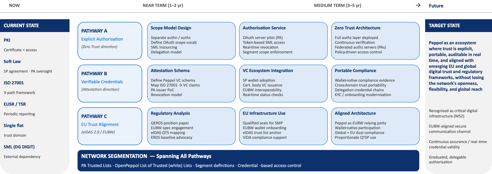

# Implications for the Trust and Security Architecture

Taken together, the regulatory and technical trends create a clear direction for the 
evolution of Peppol's trust and security architecture, while also surfacing several 
important tensions and design choices that the workstream must navigate.

---

## The Two-Layer Trust Architecture

A key structural insight from the trend analysis is that the Peppol trust architecture 
operates — and increasingly will need to operate — at two distinct layers:

| Layer 1: Transport Trust | Layer 2: Ecosystem Trust |
|---|---|
| Who may connect to and operate within the Peppol network? | Who may do what, on behalf of whom, with which compliance evidence? |
| Addressed today through PKI certificates and TIAs. Will remain relevant, but may be augmented by OAuth-based token authorisation and SP accreditation attestations. | Today largely implicit and contract-based. Primary focus of the eIDAS 2.0/EUBW trend and the Zero Trust architectural direction — and the layer where the most significant evolution is needed. |

---

## Three Architectural Evolution Pathways

Building on the CIWG 2.0 mandate and the trend analysis, three architectural evolution 
pathways can be identified. These are **not mutually exclusive**. They operate at 
different layers and timescales and are intended to complement each other.

*Figure 5: Three parallel, complementary evolution pathways from the current state toward the future trust architecture, with network segmentation as the spanning governance layer*

---

### Pathway A: Explicit Authorisation (Zero Trust Direction)

Evolving from implicit certificate-based access to explicit, policy-driven authorisation.

**This involves:**

- Separating authentication (identity verification via PKI or eIDAS means) from authorisation (policy-based access decisions)
- Exploring an OAuth 2.0-based authorisation service for Access Point operations
- Defining an authorisation scope model for Peppol operations (send, receive, register, discover)
- Enabling delegation expressions: a business entity authorising an SP to act on its behalf within defined parameters
- Piloting token-based access for SML interactions (SML insourcing creates the technical window)

**Primary deliverable:** [Future Trust Architecture — Identity and Credential Framework](../../future-trust-architecture/identity-and-credential-framework)

---

### Pathway B: Verifiable Compliance Evidence (VC / Attestation Direction)

Moving from document-based, point-in-time compliance evidence to machine-readable, 
continuously verifiable attestations.

**This involves:**

- Defining a Peppol Attestation Schema for SP accreditation credentials
- Piloting issuance of SP accreditation VCs by a Peppol Authority (as an early-mover PoC)
- Mapping existing ISO 27001 evidence to VC-representable claims
- Engaging with EUBW regulation development to position OpenPeppol as an attestation issuer and relying party
- Defining revocation processes for Peppol-issued credentials aligned with VC ecosystem standards

**Primary deliverable:** [Future Trust Architecture — Identity and Credential Framework](../../future-trust-architecture/identity-and-credential-framework)

---

### Pathway C: EU Trust Service Alignment (eIDAS 2.0 / EUBW Direction)

Leveraging EU trust infrastructure where it adds value without creating barriers to 
global participation.

**This involves:**

- Analysing where eIDAS-qualified trust services could strengthen Peppol's trust model (e.g., qualified electronic seals for SMP entries, qualified timestamps for document transactions)
- Developing a position on qualified status for Peppol SPs: where is it valuable, where is it disproportionate
- Engaging with the EUBW regulation development process to influence technical specifications for SP attestations
- Designing for interoperability between Peppol's trust model and Business Wallet interactions
- Ensuring that EU-specific trust service requirements do not fragment the global Peppol network
- Developing and advocating a proportionate ERDS/QERDS framework: ERDS-level compliance for standard business document exchange, with QERDS reserved for high-evidentiary and formal public-law contexts

**Primary deliverable:** [Peppol-ERDS Formal Gap Analysis (D3.7)](../../erds-gap-analysis/)
