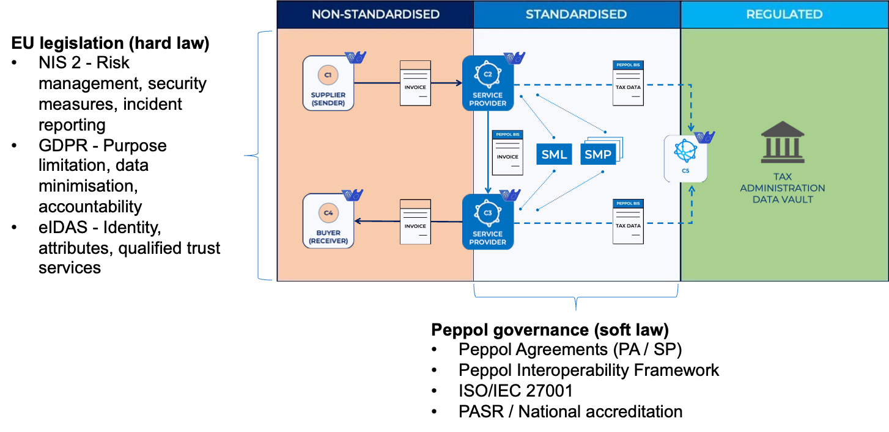
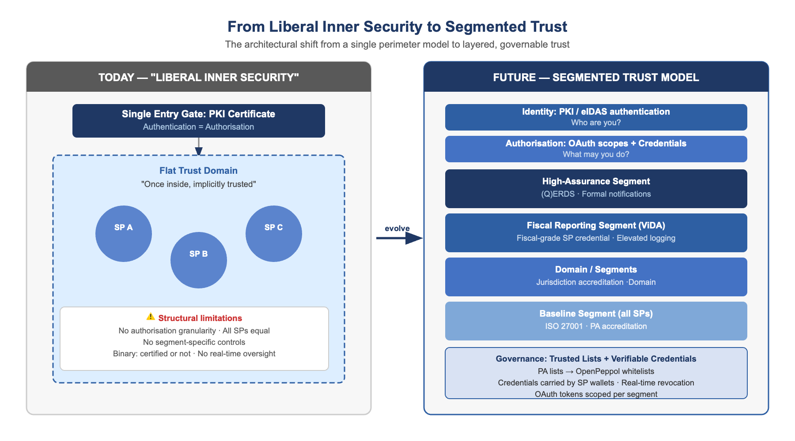

# Current Status of the Peppol Trust Model

The current Peppol trust and security architecture is built on a well-established set 
of components that have proven effective in supporting the network's growth from a EU 
eProcurement pilot to a global business document exchange infrastructure.

---

## The Existing Architecture: Foundations and Strengths

### The Four-Corner Model and Role Separation

Peppol operates on the four-corner model, in which a sending service provider 
(Corner 2 / Access Point) transmits structured business documents to a receiving service 
provider (Corner 3 / Access Point) on behalf of their respective business customers 
(Corner 1 and Corner 4). This model provides a clear separation of roles and a defined 
set of trust relationships between the corners.

The governance of Corner 2 and Corner 3 service providers is exercised through soft law: 
the Peppol Service Provider Agreements define the obligations of service providers, while 
Peppol Authorities (PAs) are responsible for onboarding and oversight within their 
jurisdictions. OpenPeppol sets the policy framework; enforcement is distributed.

*Figure 1: Four-corner model and governance structure*

### PKI-Based Trust for Transport

Message-level authentication in the Peppol network relies on a PKI (Public Key 
Infrastructure) hierarchy managed by the OpenPeppol operating office. Service providers 
receive Peppol-issued certificates that establish their identity within the network. 
Certificate possession is the primary mechanism by which a service provider proves its 
right to participate in the network — to send and receive documents using Peppol's 
transport protocols (AS4).

This model is functionally sound and has scaled well. However, it embodies what can 
be described as a **"liberal inner security" model**: the network establishes a single 
entry gate through PKI, and entities inside that perimeter are implicitly trusted across 
domains, jurisdictions, and use cases. A valid certificate grants broad network access 
without expressing what specific actions the holder is authorised to perform, on whose 
behalf, or under which conditions. Authentication and authorisation are conflated.

This model was a deliberate and appropriate design choice for a network in its growth 
phase. It is now increasingly misaligned with sector-specific regulation, national 
governance requirements, and modern Zero Trust security principles — and it makes 
real-time security supervision structurally difficult.

*Figure 2: The shift from liberal inner security (single flat trust domain) to segmented trust with layered accreditation and credential-based access control*

### Service Metadata Infrastructure

The Service Metadata Locator (SML) and Service Metadata Publisher (SMP) infrastructure 
provide the directory layer of the Peppol network: they enable senders to discover which 
service provider handles a given recipient and what document types and processes they 
support. The SML is currently operated by the European Commission's DG DIGIT under a 
service agreement, a dependency that both creates stability and constrains architectural 
flexibility. The ongoing SML insourcing project — bringing the SML under OpenPeppol's 
direct control — opens new possibilities for trust-related functionality at the 
infrastructure layer.

---

## The Current Security Assurance Framework

OpenPeppol's current security assurance model for service providers combines contractual 
obligations with a certification-based evidence framework. A key decision in recent years 
has been the introduction of ISO/IEC 27001 certification as the primary evidence of 
information security governance maturity for service providers.

### ISO 27001 as the Baseline

ISO/IEC 27001 certification attests to the existence and operation of an Information 
Security Management System (ISMS) and a set of documented controls. It is recognised 
across jurisdictions and sectors, and provides a common language for assessing security 
posture across a globally distributed network of service providers.

However, ISO 27001 has known limitations in the Peppol context. Certification attests 
to the existence of controls; it does not verify the adequacy or effectiveness of those 
controls as deployed in the specific operational context of Peppol. An SP can hold a 
valid ISO 27001 certificate while maintaining inadequate logging, insufficient access 
controls on its Access Point, or no meaningful detection capability for Peppol-specific 
fraud typologies such as invoice injection or identity fraud at the participant level.

---

## Known Gaps in the Current Model

The current model has several structural gaps that the trust and security architecture 
work must address:

**No real-time or continuous verification.** Compliance is assessed at point-in-time 
intervals. Between audits and certification cycles, OpenPeppol has limited visibility 
into the actual security posture of the network.

**Authorisation is implicit.** Peppol certificates do not express what a service provider 
is authorised to do, on whose behalf, or with which limitations. Delegation relationships 
— for example, an SP acting on behalf of a large enterprise across multiple legal entities 
— are handled through contractual arrangements and not reflected in the network's 
technical layer.

**Binary compliance status.** The approve/revoke model creates discontinuities. SPs in 
transition between compliance states have limited structured pathways, and the network 
cannot express graduated trust levels.

**Jurisdiction heterogeneity.** Peppol Authorities operate across jurisdictions with 
varying regulatory maturity. The effectiveness of SP oversight varies accordingly, 
creating network-level risk from a weakest-link dynamic.

**No structured mechanism for security posture assessment between cycles.** There is no 
common framework for evaluating the effectiveness of controls between certification cycles, 
no standardised incident response capability requirements, and no defined early-warning 
process for security deterioration.

**End-user security and KYC gap.** Peppol's trust architecture is architected around 
service providers. End-user security — the onboarding, identity verification, and ongoing 
due diligence of the businesses that SPs serve — is largely outside the standardised scope. 
As Peppol is mandated for fiscal reporting use cases and as initiatives such as EUBW 
introduce requirements for non-repudiable proof of submission and delivery, legal 
responsibility is shifting closer to the end user. The current KYC and onboarding framework 
does not reflect this shift, creating a structural gap between Peppol's trust model and 
emerging legal expectations.
