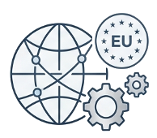
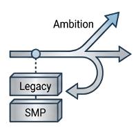
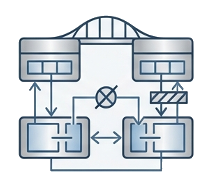
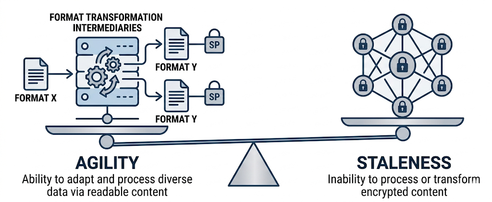

# Key Design Tensions and Trade-offs

The workstream will need to develop explicit positions on several key design tensions. 
These are not questions with obvious right answers — each represents a genuine trade-off 
between legitimate competing objectives. The purpose of naming them explicitly is to 
ensure they are resolved through deliberate architectural choice rather than left to drift.

---

## Global reach vs. EU regulatory alignment

{: style="float:right; margin-left:1.5rem; width:120px"}

eIDAS 2.0 and EUBW are EU-specific frameworks. Architectural choices that depend on EU 
trust services or EU Digital Identity infrastructure will not be available to non-EU 
service providers and participants. The architecture must have a clear story for how 
non-EU actors are accommodated.

{: .open-question }
> **Open question:** Where is the acceptable boundary between EU-specific capability 
> (available to EU participants as an enhanced tier) and core Peppol capability 
> (available globally)? Is this a segmentation question or a layering question?  
> Tracked in [issue #](https://github.com/emningno/CIWG-WS3/issues/).

---

## Centralised control vs. decentralised verification

{: style="float:right; margin-left:1.5rem; width:160px"}

A wallet-based, holder-centric attestation model reduces operational burden on OpenPeppol 
but requires relying parties to implement verification capabilities. The architecture must 
balance operational simplicity for smaller SPs with the security benefits of decentralised 
verification.

---

## Ambition vs. backward compatibility

{: style="float:right; margin-left:1.5rem; width:130px"}

More ambitious architectural options (Zero Trust token authorisation, wallet-native 
credential presentation) may require significant changes to existing AP and SMP 
implementations. The workstream must define an evolution path that does not impose 
breaking changes in the near term while keeping ambitious options open for the medium term.

---

## Segmentation vs. interoperability

{: style="float:right; margin-left:1.5rem; width:130px"}

Network segmentation enables governable, differentiated trust at scale — but introduces 
the risk of fragmentation if segments become siloed. The architecture must ensure that 
segment-specific requirements do not prevent cross-segment document exchange where it 
is legitimate, and that the segment model does not become a mechanism for market exclusion.

{: .note }
> Segments should be additive layers of assurance, not barriers to interoperability.

---

## End-to-end encryption vs. format transformation capability

*The structural trade-off: format transformation agility (left) vs. encrypted content staleness (right)*

This is the most structurally acute of the five tensions — and the one with the most 
immediate policy implications.

The emerging pressure for E2EE in the EUBW and QERDS context creates a fundamental 
architectural conflict with the four-corner model's core value proposition. Strict E2EE 
with sole recipient key control makes SP-level format transformation structurally 
impossible. The trust architecture must develop and maintain a clear position on where 
E2EE is required and where hop-by-hop security with transformation capability is the 
appropriate design.

| Approach | Where it fits | What it sacrifices |
|---|---|---|
| Strict E2EE (C1 to C4) | Formal public-law delivery, high-assurance notification contexts | SP-level format transformation |
| Hop-by-hop security (current AS4 model) | Standard business document exchange (invoices, purchase orders, B2G) | Non-repudiable end-to-end confidentiality |
| Envelope E2EE + content hop-by-hop | Possible middle ground: metadata sealed end-to-end, content readable by APs | Complexity; requires careful scope definition |
| Pre-encryption transformation at C1 | Format transformation before encryption; C1 bears the burden | SP transformation value-add eliminated; C1 capability requirements increase |

{: .warning }
> This position needs to be actively communicated in the EUBW regulatory process 
> before protocol choices are locked. OpenPeppol's participation in the EUBW Expert 
> Group on secure communication protocols is the primary mechanism for this.

See also: [Technical Trends — The Fundamental E2EE Tension](technical-trends#the-fundamental-e2ee-tension) 
and [Deliverables — Next Steps](deliverables#immediate-next-steps).
