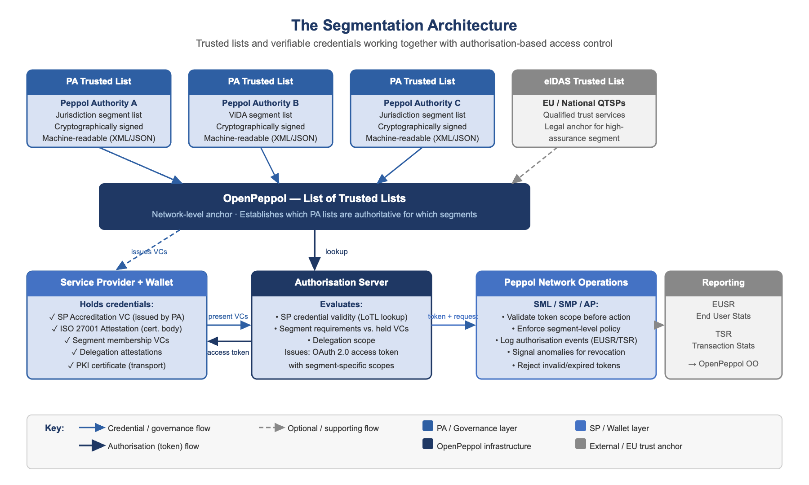

# Network Segmentation

Network segmentation — the ability to define subsets of the Peppol network with distinct 
trust requirements, accreditation levels, or operational constraints, without breaking 
the interoperability of the network as a whole — is a dimension of the trust architecture 
that has been largely absent from Peppol's design vocabulary but is becoming increasingly 
necessary.

Segmentation addresses a fundamental tension in Peppol's current model. The network is 
designed as a single, flat trust domain: a service provider that is accredited in one 
jurisdiction and for one use case has, in principle, the same network-level access as 
every other accredited SP. This was appropriate for a network focused on establishing 
basic interoperability. As the network is mandated for fiscal reporting, used for sensitive 
procurement workflows, integrated with health and financial sector systems, and operated 
under divergent national regulatory regimes, the assumption of a single flat trust domain 
becomes both a governance problem and a security risk.

{: .note }
> **The Segmentation Principle**
>
> Segmentation is not about restricting the Peppol network. It is about enabling 
> governable trust at scale. Different use cases, regulatory contexts, and risk profiles 
> require different trust assurances. The architecture should be able to express and 
> enforce these distinctions without requiring separate networks or breaking cross-domain 
> interoperability.

---

## Mechanism 1: Credential and Authorisation-Based Segmentation

The most technically elegant approach to segmentation builds directly on 
[Pathways A and B](architecture-implications): using verifiable credentials and 
OAuth-based authorisation scopes to define and enforce segment membership dynamically, 
without creating hard infrastructure boundaries.

In this model, a segment is defined by a set of requirements expressed as policy that an 
SP or participant must satisfy to be authorised to operate within it. These requirements 
might include:

- Holding a specific attestation (e.g., a fiscal-reporting-grade SP credential issued by a tax authority or PA)
- Operating within a defined jurisdiction
- Satisfying an elevated security assurance level (e.g., ISO 27001 with Peppol-specific controls)
- Meeting a sector-specific compliance requirement (e.g., DORA for financial sector document exchange)

Enforcement is achieved through the authorisation layer: when an SP requests an access 
token to perform an operation within a defined segment, the authorisation server evaluates 
whether the SP holds the required credentials and enforces the policy.

**Properties of this approach:**

- **Dynamic** — segment membership can change as credentials are issued or revoked, without requiring manual list management
- **Decentralised** — the credentials that express segment membership are held by the SP (in their wallet or key store) and verified by relying parties, not maintained in a central registry
- **Fine-grained** — multiple overlapping segments can be expressed through scope combinations, without requiring hard infrastructure separation
- **Auditable** — every authorisation decision is logged against a specific token issuance, creating a verifiable audit trail

---

## Mechanism 2: Trusted Lists and Whitelists

The second mechanism draws on a more established governance model: the trusted list. 
This approach is well-proven in the EU context — eIDAS mandates that each member state 
maintains a national Trusted List of qualified trust service providers, with the European 
Commission maintaining a pan-EU list of trusted lists.

Applied to Peppol, a trusted list architecture could work as follows:

- Each Peppol Authority maintains a jurisdiction-specific or domain-specific accreditation list — a machine-readable, cryptographically signed register of service providers that meet the requirements for a given segment
- OpenPeppol maintains a list of trusted lists at the network level, establishing which PA-maintained lists are authoritative for which segments and jurisdictions
- Relying parties — whether other SPs, tax authorities, or business participants — can resolve segment membership by consulting the appropriate list, without requiring real-time contact with OpenPeppol's central infrastructure

**Properties of this approach:**

- **Precedent and regulatory legitimacy** — the trusted list model is already embedded in EU law (eIDAS) and is understood by regulators, tax authorities, and auditors
- **Jurisdictional flexibility** — PAs can maintain their own lists aligned with local regulatory requirements, while OpenPeppol's list of trusted lists provides the network-level anchor
- **Interoperability with the VC model** — a Verifiable Credential can serve as the cryptographic proof of list membership
- **Revocation and lifecycle management** — a trusted list can be updated by the PA when an SP's accreditation status changes, providing a governance-authoritative revocation mechanism

---

## The Complementary Architecture

The most robust segmentation architecture uses both mechanisms in complementary roles, 
aligned to the two trust layers:

**Trusted lists govern accreditation (Layer 1 — who is in the network and which segments).** 
PAs publish machine-readable accreditation lists per segment. OpenPeppol maintains the 
list of trusted lists. These provide the authoritative, governance-level record of which 
SPs are accredited for which contexts.

**Credentials carry membership into the runtime (Layer 2 — what may be done in a given 
interaction).** An SP's presence on a trusted list is attested by a Verifiable Credential 
issued by the PA. The SP presents this credential as part of an OAuth authorisation 
request, enabling the authorisation server to issue scoped tokens for the segment-specific 
operations the SP is entitled to perform.

This architecture mirrors the eIDAS model closely: the Trusted List is the governance 
layer (analogous to the EU Trusted List of QTSPs), the VC is the portable proof of list 
membership (analogous to a qualified certificate), and the authorisation token is the 
runtime access mechanism.

*Figure 6: The segmentation architecture — PA trusted lists feed the OpenPeppol list of trusted lists, SPs hold credentials in wallets, the authorisation server issues scoped tokens, and network operations enforce segment policy*

---

## Segment Examples

The following are illustrative examples of segments that could be defined within the 
Peppol network. These are not proposals; they are intended to make the segmentation 
concept concrete.

| Segment | Additional Requirements | Mechanism |
|---|---|---|
| **Baseline** (all SPs) | ISO 27001 / three-path equivalent, TIA, PA accreditation | Existing PKI + PA accreditation list |
| **Fiscal reporting** (ViDA) | Fiscal-grade SP credential from PA or tax authority, elevated logging, near-real-time incident reporting | PA trusted list (fiscal segment) + VC + OAuth fiscal scope |
| **High-assurance cross-border** | QTSP-issued credentials, QERDS capability for formal notifications | eIDAS Trusted List anchor + QTSP VC + QERDS capability attestation |

---

## Mechanism Comparison

| | Credential / Authorisation Segmentation | Trusted List Segmentation |
|---|---|---|
| **Strengths** | Dynamic, fine-grained, decentralised, wallet-native | Governance-proven, regulatory-familiar, federalised, auditable at list level |
| **Best for** | Runtime access control, delegation, multi-level trust within a session | Accreditation publication, regulatory reporting, cross-jurisdiction recognition |
| **Complexity** | Requires authorisation service infrastructure and scope model design | Requires list publication infrastructure and PA operational commitment |
