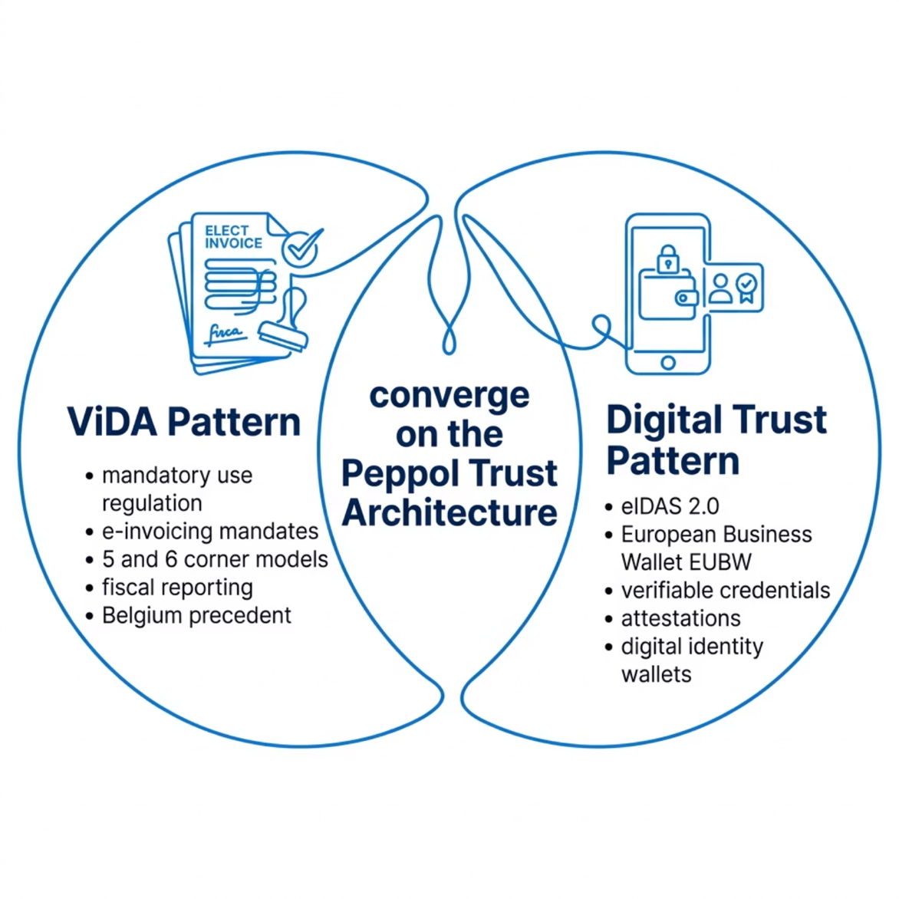
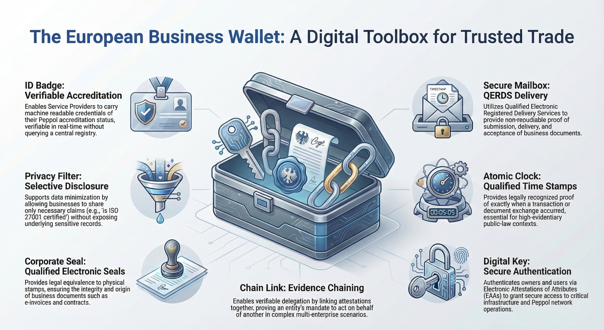

# Regulatory Trends

Two structurally distinct regulatory trends are converging on the Peppol ecosystem. 
They are not in conflict — indeed, they may ultimately reinforce each other — but they 
operate through different mechanisms and create different demands on the trust architecture.

*Figure 3: Two converging regulatory trends and the cross-cutting compliance layer affecting Peppol service providers*

---

## Trend 1: Mandatory Use Regulation — The ViDA Pattern

The first trend is the increasing use of EU law and national legislation to mandate the 
use of trusted digital ecosystems like Peppol for fiscal reporting, electronic invoicing, 
and administrative document exchange.

### ViDA and the e-Reporting Mandate

ViDA (Council Directive amending Directive 2006/112/EC as regards VAT rules for the 
digital age) introduces mandatory digital reporting obligations for intra-EU business 
transactions, phased in from 2030. Critically, ViDA contemplates a model in which 
certified, trusted network infrastructures — including Peppol-compatible networks — 
serve as the conduit for both business document exchange and tax authority reporting.

This creates what is sometimes described as the **five-corner or six-corner model**. 
In addition to the traditional four corners (seller, seller's AP, buyer's AP, buyer), 
fiscal reporting obligations introduce additional corners: the tax authority as a 
systematic receiver or validator of transaction data, potentially in real-time or 
near-real-time.

{: .note }
> **The Policy Trade-Off Under ViDA**
>
> Regulatory effectiveness is maximised when control is placed in trust frameworks 
> rather than embedded in interoperability layers. ViDA should regulate actors and 
> processes, while reusing existing EU interoperability mechanisms rather than 
> duplicating controls at the network level for Corners 1 and 2. The risk is that 
> fiscal mandates fragment the interoperability layer by creating jurisdiction-specific 
> technical requirements that diverge from Peppol's common interoperability framework.

### National Mandates: Belgium as Precedent

Belgium has implemented a VAT reporting mandate that leverages Peppol as a mandated 
network, creating a legally binding obligation for businesses to use Peppol-certified 
service providers for e-invoicing. This creates a direct regulatory link between private 
law (Peppol's soft law governance) and public law (VAT legislation).

This pattern is likely to be replicated across EU member states as ViDA is transposed. 
The implications for OpenPeppol's trust architecture are significant when SPs operate 
under fiscal mandate: their compliance failures have direct legal consequences (not just 
network-level sanctions), and the regulatory bodies involved (tax authorities, financial 
supervisors) may have different expectations of evidence and assurance than OpenPeppol's 
current soft law framework provides.

### Tension: Mandated Infrastructure vs. Independent Network

There is a fundamental tension that the regulatory integration of Peppol creates. On one 
hand, being mandated by law gives OpenPeppol legitimacy, scale, and regulatory support. 
On the other hand, it creates dependencies on specific legislative frameworks that may 
constrain the network's global reach, its member-driven governance, and its ability to 
evolve independently.

| Opportunities | Risks |
|---|---|
| Network legitimacy through regulatory mandate | Fragmentation if each jurisdiction creates bespoke technical requirements |
| New sources of funding (certification fees, accreditation) | Increased complexity for global (non-EU) SPs |
| Stronger grounds for enforcing SP compliance | Regulatory capture — Peppol becoming an instrument of a single regime |
| Tax authority requirements drive higher-quality AP implementations | Governance tension between member consensus and regulatory obligation |

---

## Trend 2: Digital Trust Infrastructure — The eIDAS 2.0 and EUBW Pattern

The second major regulatory trend operates at a different level: it is not about mandating 
the use of Peppol, but about creating a new digital trust infrastructure across the EU 
that Peppol can choose to leverage, interact with, or accommodate in its own trust model.

### eIDAS 2.0 — The Framework

Regulation (EU) 2024/1183 (eIDAS 2.0) substantially expands the original eIDAS framework. 
Beyond qualified electronic signatures and authentication, eIDAS 2.0 introduces:

- European Digital Identity Wallets (EUDIW) as a mandatory citizen-facing digital identity infrastructure across EU member states
- Electronic Attestations of Attributes (EAAs) as a mechanism for issuing verifiable, portable, and selectively disclosable credentials about persons and entities
- Qualified Electronic Attestations of Attributes (QEAAs) with full legal equivalence to qualified certificates in covered domains
- A trust framework for cross-border interoperability of identity and attribute assertions, built on common technical standards (ARF — Architecture Reference Framework)

For Peppol, eIDAS 2.0 is not directly about consumer identity. It is about the enabling 
infrastructure it creates for attestation-based trust between business actors and service 
providers.

### The European Business Wallet (EUBW) — The Business-Facing Extension

*Figure 4: EUBW — a digital toolbox for trusted trade*

The proposed EUBW regulation (COM(2025) 838 final, published November 2025) is the 
business-facing complement to the citizen-facing EUDIW. It proposes a wallet infrastructure 
specifically designed for legal entities — companies, SMEs, micro-enterprises, public 
sector bodies, and self-employed persons — enabling them to:

- Manage and use electronic attestations of attributes, including owner identification data with selective disclosure
- Request and share data between Business Wallets, EU Digital Identity Wallets, and Business Wallet relying parties
- Create and use qualified electronic signatures and seals, qualified electronic timestamps, and qualified electronic registered delivery services
- Issue electronic attestations of attributes (i.e., act as an attestation issuer, not just a holder)
- Link attestations to other relevant attestations forming chains of verifiable evidence
- Authenticate users and owners via (Q)EAAs
- Operate through secure communication channels with assigned digital addresses

A key principle of the EUBW is **legal equivalence**: use of core wallet functionality 
shall have the same legal effect as the equivalent action carried out in person, in paper 
form, or through other legally recognised means.

### EUBW Wallet Owners and Scope

The EUBW will be available to: economic operators (companies, SMEs, micro-enterprises, 
self-employed persons, sole traders); public sector bodies at all levels; EU institutions; 
and third-country economic operators subject to identity verification and applicable 
conditions. This broad scope means that, if widely adopted, virtually all Peppol 
participants could hold and use a Business Wallet.

### Attestations as the Currency of Trust

Central to both the eIDAS 2.0 and EUBW frameworks is the concept of the **attestation**: 
a structured, digitally signed, verifiable statement issued by a trusted authority about 
a subject's identity, attributes, qualifications, or compliance status.

{: .note }
> **Key Principle: Sharing Trust ≠ Sharing Data**
>
> The power of the attestation model is that it separates trust from data. An issuer 
> can certify that an entity meets a requirement — e.g., holds ISO 27001 certification, 
> is a registered Peppol Service Provider, has no outstanding regulatory sanctions — 
> without revealing the underlying data. The relying party receives a cryptographically 
> verifiable proof of the claim, not access to the source record. This is the foundation 
> of the verifiable credentials paradigm.

### Implications for Peppol's Trust Architecture

The EUBW and eIDAS 2.0 framework have several direct implications for the Peppol trust 
and security architecture:

**Service Provider attestations.** OpenPeppol or Peppol Authorities could issue 
attestations of Peppol SP accreditation status that SPs carry in their Business Wallets. 
Relying parties could verify SP compliance status without querying a central Peppol 
database, reducing friction and enabling real-time verification.

**Supplier/participant attestations.** Business participants (Corners 1 and 4) could 
hold attestations of their regulatory status, procurement eligibility, or approved supplier 
status in their Business Wallets, enabling trust-enhanced use cases beyond simple document 
transport.

**Delegation and representation.** The EUBW's ability to link attestations in chains 
enables verifiable delegation: an SP can carry an attestation that it is authorised to 
act on behalf of a specific business entity, with a verifiable chain back to the original 
mandate. This addresses one of the most complex trust challenges in multi-AP environments 
and large enterprise scenarios.

**Qualified status for Peppol SPs.** eIDAS 2.0 introduces the possibility that Peppol 
SPs — particularly those handling qualified electronic signatures, seals, or timestamps 
— may need or choose to acquire qualified trust service provider status. The architecture 
must be clear about where qualification adds value and where it would create 
disproportionate barriers.

---

## ERDS and QERDS — The Qualification of Transport Services

A third dimension of the eIDAS 2.0 regulatory trend concerns the qualification of 
transport services themselves. The eIDAS framework distinguishes between Electronic 
Registered Delivery Services (ERDS) and Qualified Electronic Registered Delivery Services 
(QERDS). This distinction is institutional and evidentiary rather than technical: both 
ERDS and QERDS provide secure, evidenced delivery with identification of sender and 
recipient, integrity protection, non-repudiation, and evidence of sending and receipt.

### Regulatory recognition of Peppol

A significant development directly relevant to Peppol is that the recently adopted 
Implementing Regulation on QERDS **explicitly references the eDelivery four-corner model 
as a presumption of compliance with QERDS technical requirements.** This is a material 
recognition: it confirms that Peppol's architecture already meets the security and 
evidence standards at issue. The remaining gap between Peppol's current model and QERDS 
is solely one of **provider qualification status**, not technical capability.

### The opportunity and the risk

For the Peppol trust architecture, this creates both an opportunity and a risk. The 
opportunity is that ERDS-level recognition of Peppol's transport model could be formally 
anchored in regulatory frameworks such as ViDA. The risk is any move towards blanket 
QERDS mandates — requiring all business document exchange to be carried by a QTSP. 
Across large parts of the EU, no QERDS market currently exists, meaning a blanket mandate 
would disqualify every operational Peppol service provider in those jurisdictions from 
day one.

### The proportionality principle

For business documents such as eInvoices, legal effect arises from VAT law, accounting 
law, contract law, and sectoral regulation — not from the qualification status of the 
transport provider. A proportionate regulatory approach would require ERDS-level 
guarantees for regulated business document exchange, reserving QERDS for clearly defined 
high-evidentiary and formal public-law contexts. The trust and security architecture 
should be designed to support this proportionality principle and to engage actively with 
policymakers to reinforce it.

The formal gap analysis between Peppol's current architecture and the ERDS definition 
is scoped as a separate dedicated deliverable — see [D3.7 Peppol-ERDS Formal Gap Analysis](../../erds-gap-analysis/).

---

## The Regulatory Landscape for Service Providers

Beyond the two major trend lines, Peppol service providers face a layered set of 
regulatory obligations that the trust and security architecture must accommodate.

### NIS2 — Network and Information Security

Directive (EU) 2022/2555 (NIS2) expands the scope of the original NIS Directive and 
imposes mandatory risk management, incident reporting, and supply chain security 
obligations. Digital infrastructure providers, including those providing business document 
exchange services at scale, are likely to fall within scope in several member states.

Key NIS2 requirements include: risk management measures proportionate to the risk; supply 
chain security obligations relevant for SPs that rely on cloud infrastructure or 
third-party components; incident reporting to competent authorities within 24 hours 
(initial notification) and 72 hours (detailed report); and personal liability of senior 
management for non-compliance.

NIS2 creates a strong incentive for ISO 27001 adoption as a recognised framework for 
demonstrating compliance with NIS2's risk management requirements. However, ISO 27001 
alone is not sufficient — NIS2 requires specific incident reporting capabilities and 
supply chain due diligence that go beyond what ISO 27001 certification attests to.

### DORA — Digital Operational Resilience for the Financial Sector

Regulation (EU) 2022/2554 (DORA) applies to financial sector entities and their ICT 
third-party service providers. Peppol service providers that process financial documents 
— particularly those involved in payment-adjacent workflows such as e-invoicing integrated 
with payment initiation, or those serving financial institutions — may be subject to DORA 
directly or via their customers' supply chain requirements.

DORA's requirements for ICT risk management, operational resilience testing, incident 
classification, and third-party ICT risk management are more prescriptive than NIS2 and 
ISO 27001 in several areas. The Peppol trust architecture should avoid creating unnecessary 
friction for DORA-compliant service providers.

### GDPR — Data Protection Implications

While not a security framework per se, GDPR (Regulation (EU) 2016/679) has direct 
relevance to the Peppol trust architecture. Business document exchange involves the 
processing of personal data (names, addresses, contact details, and potentially sensitive 
procurement data) by service providers acting as data processors.

The move towards attestation-based trust and selective disclosure has an important GDPR 
dimension: the principle of data minimisation supports attestation models where only the 
necessary claim is shared, rather than the underlying certificate documentation. The trust 
architecture should be designed with privacy-by-design principles, leveraging the selective 
disclosure capabilities of the VC/attestation model to minimise data exposure.
